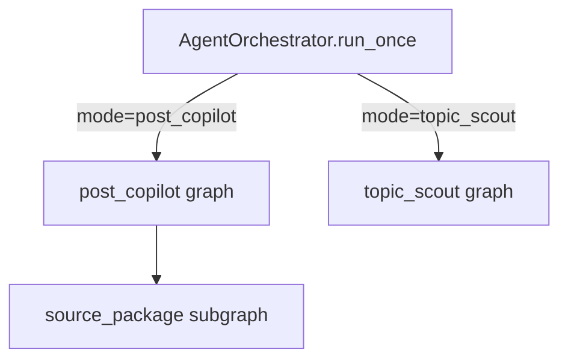

# Agent Graphs

This folder documents every graph and subgraph currently used by the agent runtime in `postbridge-core`.

Current graph inventory:

1. [`post_copilot.md`](./post_copilot.md)
2. [`source_package.md`](./source_package.md)
3. [`topic_scout.md`](./topic_scout.md)

## Topology overview

## Notes

- All documented flows are currently compiled through `compile_linear_graph(...)` in [`src/postbridge/agent/runtime.py`](../../src/postbridge/agent/runtime.py).
- `source_package` is the only embedded subgraph today.
- `AgentOrchestrator` is the runtime entrypoint, but it is not itself a LangGraph graph.
