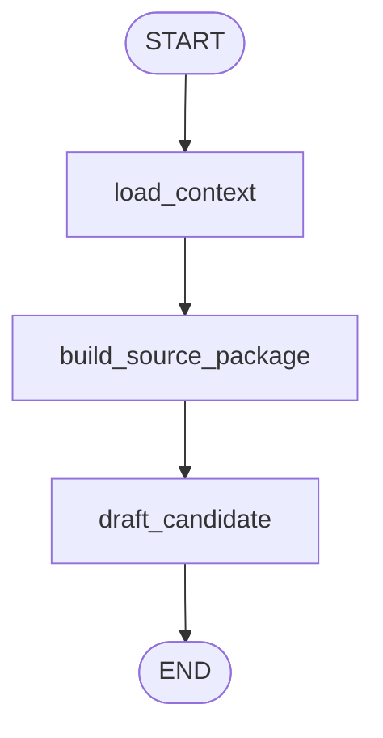

# `post_copilot` Graph

Source: [`src/postbridge/agent/graphs/post_copilot.py`](../../src/postbridge/agent/graphs/post_copilot.py)

## Purpose

Editor flow for draft creation and draft revision.

## Diagram

## Nodes

### `load_context`

Reads channel context, style profile, recent publications, and current draft state.

### `build_source_package`

Invokes the compiled `source_package` subgraph and merges its outputs back into parent state.

### `draft_candidate`

Builds the editor prompt, injects workspace policy and image constraints, and normalizes the final candidate.

## Inputs

- `tenant_id`
- `channel_id`
- `user_request`
- `content_item_id`
- `image_request`
- `seed_urls`
- `approved_image_urls`
- `workspace_policy`

## Outputs

- `selected_candidates`
- `source_package`
- `source_package_summary`
- `tool_trace`

## Embedded subgraphs

- [`source_package.md`](./source_package.md)

## Notes

- This flow embeds `source_package` as a real subgraph.
- It is used by the orchestrator when `mode == "post_copilot"`.
