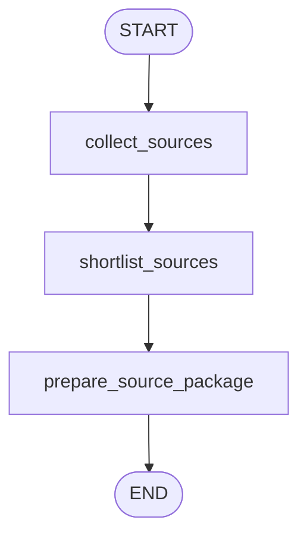

# `source_package` Subgraph

Source: [`src/postbridge/agent/graphs/source_package.py`](../../src/postbridge/agent/graphs/source_package.py)

## Purpose

Reusable source-discovery flow that collects, shortlists, and packages sources plus image candidates.

## Diagram

## Nodes

### `collect_sources`

Collects explicit `seed_urls` first, otherwise runs topic discovery with workspace-level source filters.

### `shortlist_sources`

Uses `shortlist_topic_evidence(...)` to build a smaller editorial pack.

### `prepare_source_package`

Builds the final source package, extracts image candidates, and computes summary metrics.

## Inputs

- `topic_definition`
- `user_request`
- `seed_urls`
- `image_request`
- `approved_image_urls`
- `workspace_policy`

## Outputs

- `source_bundle`
- `shortlisted_source_bundle`
- `source_shortlist_summary`
- `source_package`
- `source_package_summary`
- `tool_trace`

## Notes

- This flow is compiled independently and then invoked from `post_copilot`.
- It is also the source-review artifact shown to users before draft generation.
