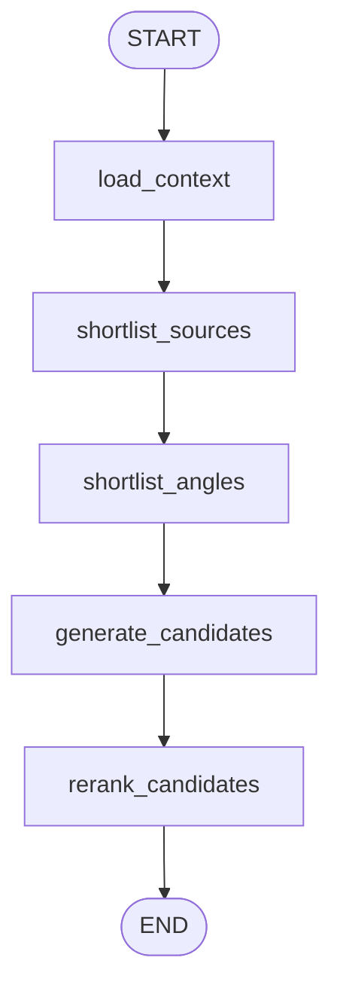

# `topic_scout` Graph

Source: [`src/postbridge/agent/graphs/topic_scout.py`](../../src/postbridge/agent/graphs/topic_scout.py)

## Purpose

Discovery flow for topic ideation, evidence gathering, angle selection, and reranked candidate generation.

## Diagram

## Nodes

### `load_context`

Loads channel context and source evidence through `collect_topic_evidence(...)` with workspace policy applied.

### `shortlist_sources`

Builds a tighter shortlist of evidence sources.

### `shortlist_angles`

Generates a more diverse angle pack from shortlisted sources.

### `generate_candidates`

Builds the ideation prompt, injects workspace policy, and normalizes structured topic candidates.

### `rerank_candidates`

Runs reranking and applies angle-diversity penalties to avoid repetitive results.

## Inputs

- `tenant_id`
- `channel_id`
- `topic_definition`
- `user_request`
- `seed_urls`
- `workspace_policy`

## Outputs

- `selected_candidates`
- `tool_trace`

## Notes

- This flow stays in ideation mode and does not materialize a draft.
- It is used by the orchestrator when `mode == "topic_scout"`.
